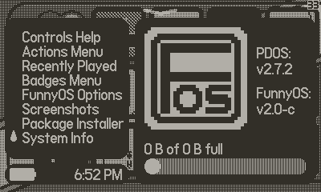

# FunnyOS
Grid-based playdate custom launcher based on the 3ds menu (with badges!)

Made for playdateOS 2.6.2 and up, 2.7.0 required for networking features.

## Features
- grid-based icon system, different from the list-based default one, similar to the 3ds
- "badges" similar to those on the 3ds, that can be created from any square .pdi image
- square-shaped convenient widgets that anybody can easily program
- labels system, letting you create and name "labels" (sections of objects) on the grid that allow organisation and faster movement
- button combinations letting you do anything without ever opening a menu or holding a button
- alphabetical organization by default to make it easier to find games when you first install it

## Navigation
- FOS2 is based almost entirely on button combinations to do most major actions
- To open the "control center," press A+DOWN
    - Button combos are similar to how keyboard shortcuts work on computers, think of A and B as ctrl/alt and the directions as actual keys (i.e. hold A and/or B and THEN press the direction to execute a combo)
- To navigate, use the DPAD. To select a label or object, press A. To go back, press B.
- While the first label on your home screen is selected, press LEFT to access the widgets list! If you have no widgets this will show up blank, but if you place some into the shared folder it will show them all there.

## Instructions
### Installing on hardware

Video tutorial available [here](https://www.youtube.com/watch?v=L6Q6Tsoksgg) for installations not utilising FunnyLoader.
  
1. Download FunnyOS-2.pdx and os-download-x.x.x.py from the [releases](https://github.com/RintaDev5792/FunnyOS/releases) page
1. Run os-download and follow the instructions. After it is complete, you should have a .pdos and a .pdkey file in the same directory
1. Rename the PlaydateOS.pdos file to a .zip and unzip it

#### If installing only FunnyOS
1. Go into the new folder and then /System, and rename Launcher.pdx to StockLauncher.pdx
1. Copy your FunnyOS.pdx file into the System folder and rename it to Launcher.pdx
1. If you intend to use the FunnyLoader widget as given in the Widgets section, follow the FunnyLoader instructions for directory setup, just using FunnyOS2.pdx swapped for FunnyLoader.pdx.  

#### If utilising FunnyLoader to have multiple launchers
1. Go into the new folder and then /System, and create a folder named "Launchers" inside of it with that exact capitalisation
1. Copy the default Launcher.pdx from /System to /System/Launchers and rename it to whatever you want (usually "StockLauncher.pdx")
1. Copy your FunnyLoader.pdx (available from the releases page of [this](https://github.com/RintaDev5792/FunnyLoader/releases) repo) into /System (NOT /LAUNCHERS) and rename it to "Launcher.pdx"
1. Copy your FunnyOS.pdx and the .pdx files of whichever other launchers you are using into /System/Launchers
1. Name all of the .pdx files in /System/Launchers how you want them to show up in the FunnyLoader list

#### After organizing your PlaydateOS folder according to either of the previous sections
1. Re-zip the PlaydateOS folder so that everything in the folder is at the ROOT of your zip.
1. For example: if on macos open a terminal in the folder (not in System, in the root) and run "zip -r ../PlaydateOS-Patched.zip .", if on Windows go into your folder, press ctrl+a, and then compress the files instead of the folder.
1. Rename your NEW zip to a .pdos
1. Download [Playdate Utility](https://download-cdn.panic.com/playdate_utility/)
1. Open Playdate Utility, and plug in your Playdate to your computer
1. Click "Upgrade Firmware" and select your .pdos and .pdkey file in that order, wait while your playdate "installs system update"
1. Done! 

If this at any point freezes or errors out during installation, especially multiple times in a row, you can (as a last resort) hold A+B+MENU+LOCK to enter recovery mode and flash stock OS. FunnyOS installations will just about always work when installing from stock OS.

### Installing on Simulator
1. Download FunnyOS.pdx from releases and rename it "Launcher.pdx"
1. Navigate to wherever you installed the Playdate SDK, then go to `<SDK path>/Disk/System`
1. Rename the existing application `Launcher.pdx` to somthing else, like `StockLauncher.pdx`
1. Drag the `Launcher.pdx` you created in step 1 into the `System` folder
  

## Setup  
Before any of these actions can be completed, run the launcher on-device after installing.  

### Badges  
In order to load badges into FunnyOS, put any .pdi image file called `<name>.pdi` inside `/Shared/FunnyOS2/Badges`. 
This image must be compiled with `pdc` from the playdate SDK, and must be a .pdi file.  
Some pre-made badges in pdi form are available [Here](https://github.com/RintaDev5792/FunnyOS/tree/main/Assets/Badges).  
(Thanks to Palette in the Playdate Squad discord server for making OpenFunnyBadges, a badge pack to get you started!)  
As soon as you load up the launcher with .pdi files in `/Shared/FunnyOS/Badges`, they are placed on the far right of the grid.  
You can move them in organize mode just like other icons.  

If you are using FunnyOS 2, there is a built-in asset manager in which badges can be downloaded from FunnyOS servers.

### Widgets  
In order to load widgets into FunnyOS, put any .pdx file (that you know is a widget) called `<name>.pdi` inside `/Shared/FunnyOS2/Widgets`. 
Pre-made widgets are available [Here](https://github.com/RintaDev5792/FunnyOS/tree/main/Assets/Widgets).  
It is highly recommended if you have multiple launchers to install the FunnyLoader and FunnyExplorer widgets from that directory, as together they let you install, update, and switch launchers right from FOS2!  

#### To-Do List  
Lets you keep a list of strings right on your home screen!  
  
### FunnyLoader  
Lists every launcher in /System and /Launchers so you can switch to a different launcher from the FOS2 home screen!  
  
### FunnyExplorer  
A fully featured file explorer with copy,paste,rename,delete,new folder,preview, and launcher installation built in! Allows the user to preview specific file formats such as .pda and .pdi in the widget.  
  
This widget enables the use of ".fosl" files. In order to install a launcher with the Explorer, rename a .pdx file to .fosl. Then locate the file in the Explorer on device, click right to enter the context menu, and select "install as launcher."  
  
  
If you want to develop your own widgets, some example code is availale [Here](https://github.com/RintaDev5792/FunnyOS/tree/main/Widgets).  

### Music  
In order to load background music into FunnyOS, put an audio file called `bgm.pda` inside `/Shared/FunnyOS/`.  
This audio must be compiled with `pdc` from the playdate SDK, and must be a .pda file.  
The default background music is available [Here](https://github.com/RintaDev5792/FunnyOS/blob/main/Assets/bgm.pda), as compiling it into the installer takes up a lot of space.
Music provided by Chris Mandra and Drunk With Honey. Huge shoutout to them, they make some good music!  

### Background Image  
In order to load a background image into FunnyOS, put an image file called `bg.pdi` inside `/Shared/FunnyOS/`.  
This image must be compiled with `pdc` from the playdate SDK, and must be a .pdi file.  
The image will be automatically scaled to 400x240 and used as the background behind the dither pattern in the launcher.  
The default background image is available [Here](https://github.com/RintaDev5792/FunnyOS/blob/main/Assets/bg.pdi).  

If you are using FunnyOS 2, there is a built-in asset manager in which wallpapers can be downloaded from FunnyOS servers.  

### Loading Image  
In order to load a loading image into FunnyOS, put an image file called `load.pdi` inside `/Shared/FunnyOS/`.  
This image must be compiled with `pdc` from the playdate SDK, and must be a .pdi file.  
The image will be automatically scaled to 400x240 and used as the loading screen when you first enter the launcher.

### Custom Icons  
In order to load a custom icon into FunnyOS, put an image file called `icon.pdi` inside `/Shared/FunnyOS/Icons/<bundleid>` where `<bundleid>` is the name of a game you want to replace the icon of (like the `com.whoever.whatever`).  
This image must be compiled with `pdc` from the playdate SDK, and must be a .pdi file.  
The image will be automatically scaled to 64x64 and used as the icon for that game in the launcher.  
You can add animations for the icon by making a folder called `icon-highlighted` inside of `/Shared/FunnyOS/Icons/<bundleid>`, and putting an `animation.txt` file and your numbered frame pdi files in it (`1.pdi`, `2.pdi`, etc).   
See [here](https://sdk.play.date/2.5.0/Inside%20Playdate.html#pdxinfo) for instructions on `animation.txt`

## FAQ
> Q: how does FunnyOS import badges that aren't perfectly square or 64x64?

A: Everything is square. If something isn't exactly 64x64 or 72x72, it will be scaled to 64x64 (if the original is less than or equal to 68 pixels wide) or 72x72 otherwise. 72x72 tiles tile perfectly (and can be used to create larger images out of multiple of them), while 64x64 is the normal icon size.

> Q: how do I add badges?

A: just put any .pdi file (compiled with pdc from the Playdate SDK) into the "/Shared/FunnyOS/Badges" folder on your playdate (accessible from data disk mode when connected to a computer). Other image formats will not work, so don't try to use .pngs or .jpegs or (ew) .webps.

> Q: what happens when I add a new game or badge to my system?  

A: it is placed at the end of your grid all the way to the right. I would recommend placing a label here called "end" or similar so that you can easily skip to it.  

> Q: I hate those borders on the icons! These were designed for list view, not to be confined! Please remove them!

A: toggle them off in the options menu (playdate menu --> options)

> Q: how do I move stuff around?

A: check the "organize" checkbox in the system menu to enter organize mode. uncheck it to exit organize mode.

> Q: what does this text at the bottom mean?

A: on the left, it details what button does what, and on the right it lists the name of the section you are currently looking in.

> Q: I hate this

A: uninstall it using the installer

> Q: It borked :(

A: repair it or uninstall it using the installer, then tell me what happened and how so I can fix it

> Q: This isn't launching games! When i click a game it just shows me the card!  

A: press the A button. It says it on the bottom of the screen.

> Q: the installer isn't working!

A: this was made for playdate OS version 2.5.0, and has to be updated for every version. Find a newer version, and if one isn't available, ping me repeatedly so I can bother scratchminer to make me a new installer

> Q: my playdate is bootlooping/repeatedly crashing

A: hold A+B+MENU+LOCK then release A and B when told to hold MENU and LOCK. This resets your playdate to the stock launcher, but you will need to do a system update afterwards from settings. Submit an issue detailing how the playdate crashed.

## Credits
* IndexOS Installer and FunnyOS Installer - scratchminer
* Cool install video with the rocket + IndexOS dev - Rae
* Programming and documentation help - Ocean and Scratchminer
* FunnyOS programming - RintaDev 
* Music - Chris Mandra / Drunk With Honey
